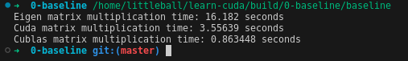
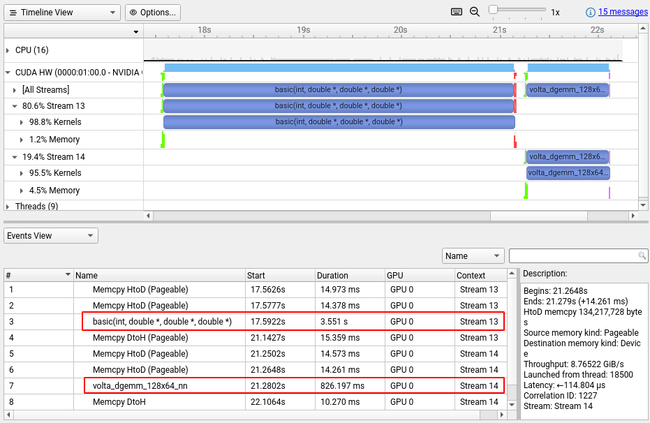

# Baseline

按照矩阵乘法的规则，两个NxN的矩阵相乘，得到的也是一个NxN的矩阵。结果矩阵中的每个元素都是由一个行向量和一个列向量求内积得到的。最直接的想法就是用NxN个线程来完成计算，每个线程负责计算一组内积。

```cpp
__global__ void basic(int N, double *a, double *b, double *c) {
  int row = blockIdx.y * blockDim.y + threadIdx.y;
  int col = blockIdx.x * blockDim.x + threadIdx.x;
  double sum = 0.0;
  for (int i = 0; i < N; i++) {
    // 注意数据是按照列优先存储的
    sum += a[row + i * N] * b[col * N + i];
  }
  c[col * N + row] = sum;
}
```

值得注意的是，如果使用Eigen库，那么矩阵的数据是优先按照列存放的，即矩阵中同一列的数据是连续地址存放的。

## 调用过程

```cpp
// 进行矩阵乘法。将数据拷贝到设备，再将结果拷贝回来
Eigen::MatrixXd result_cuda = Eigen::MatrixXd::Zero(N, N);
start = std::chrono::high_resolution_clock::now();
cudaMemcpy(d_mat1, mat1.data(), N * N * sizeof(double), cudaMemcpyHostToDevice);
cudaMemcpy(d_mat2, mat2.data(), N * N * sizeof(double), cudaMemcpyHostToDevice);
basic<<<gridSize, blockSize>>>(N, d_mat1, d_mat2, d_result);
cudaMemcpy(result_cuda.data(), d_result, N * N * sizeof(double), cudaMemcpyDeviceToHost);
cudaDeviceSynchronize();
end = std::chrono::high_resolution_clock::now();
```

调用自己写的kernel实现矩阵乘法也不需要多考虑什么，直接在一条stream上，先把数据拷贝到device，再进行运算，算完之后再把结果拷贝到host。统计这整个过程的时间。

## 结果

分别将Eigen库中的矩阵乘法，我们自己写的基础的矩阵乘法和cublas库实现的矩阵乘法进行对比。因为用到里Eigen库，所以编译的时候一定要编译Release的版本，不然用Eigen库实现的矩阵乘法需要很久。不光是直接比较时间，而且也需要确认计算结果的正确性。以Eiegn库的计算结果作为参照，要求GPU的计算结果与Eigen库的计算结果相同。最终得到如下结果：



再用Nsight Systems分析一下，可以看到这个自己写的kernel相比于cublas实现的kernel真的慢很多。


