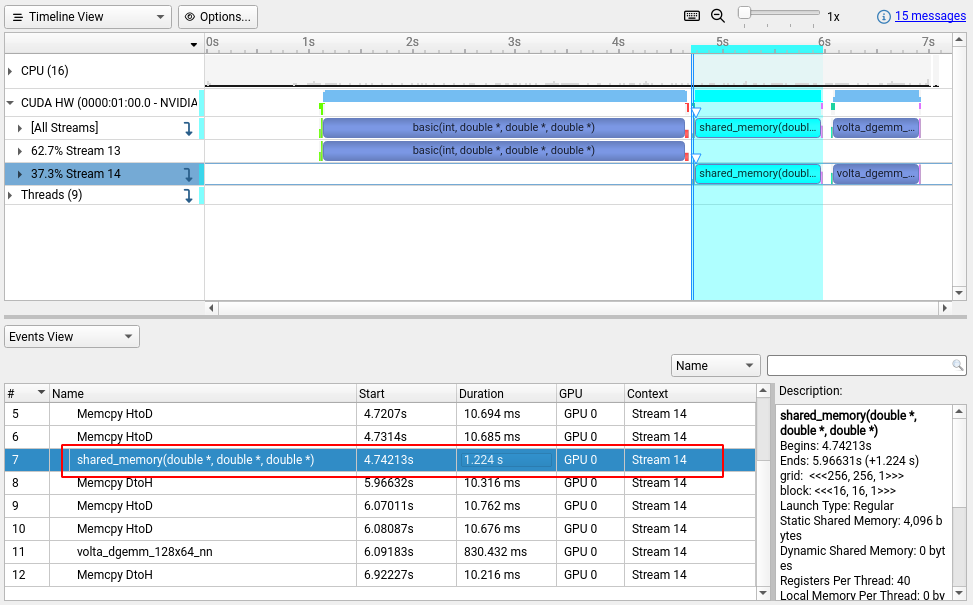

# Shared Memory

在device上malloc的数据分配在global memory中，访问global memory相对来说是比较慢的，而访问shared memory会很快，shared memory类似于scratchpad memory，是一块可以由程序员自己管理的cache。


shared memory是在片内的，而且不会经过cache，因为它很小而且访问速度够快；global memory是在片外的，而且会经过L1，L2cache。

所以如果频繁地从global memory读数据是很费时间的。考虑矩阵乘法的过程，两个相乘的矩阵需要分别被读取N次才能计算得到最终结果。

shared memory是一个thread block中的线程共享的，那么就可以考虑让一个thread block中的线程“互帮互助”。一个block中共有BLOCK_SIZExBLOCK_SIZE个线程，每个线程从global memory拷贝一个数据到到shared memory，这些数据就可以由这个block中的线程共享。在一个block中，原本一个线程需要从global memory读BLOCK_SIZE个数据，而采用共享的方式之后，就可以每个block里每个线程只读1个数据。完整的计算下来，就只需要从global memory读N/BLOCK_SIZE次数据。

这样看似乎BLOCK_SIZE越大，加速效果会越明显。但实际上block越大，block中的线程同步也会更久。而且一个block中的shared memeory是有限的，register也是有限的。一般来说总的线程数一定的话，block分的小一点，多一点，更容易把每个block分到multiprocessor上去运行，提高并行度。所以BLOCK_SIZE的选取我没有去详细比较分析了，为了简便起见，我在这里固定用的是16x16的大小。

```cpp
__global__ void shared_memory(double *a, double *b, double *c) {
  int result_row = blockIdx.y * BLOCK_SIZE + threadIdx.y;
  int result_col = blockIdx.x * BLOCK_SIZE + threadIdx.x;

  // 将结果清空
  c[result_row + result_col * N] = 0.0;

  int a_col_global, b_row_global;

  // 每个block一起load数据，放入s_a s_b中
  __shared__ double s_a[BLOCK_SIZE][BLOCK_SIZE];
  __shared__ double s_b[BLOCK_SIZE][BLOCK_SIZE];

  // 每个thread需要load N/BLOCK_SIZE次数据
  for (int i = 0; i < N / BLOCK_SIZE; ++i) {
    // 计算要搬运的数据在global下的索引
    a_col_global = i * BLOCK_SIZE + threadIdx.x;
    b_row_global = i * BLOCK_SIZE + threadIdx.y;

    // 搬运数据
    s_a[threadIdx.y][threadIdx.x] = a[result_row + a_col_global * N];
    s_b[threadIdx.y][threadIdx.x] = b[b_row_global + result_col * N];
    __syncthreads();

    // 计算部分和
    for (int j = 0; j < BLOCK_SIZE; ++j) {
      c[result_row + result_col * N] += s_a[threadIdx.y][j] * s_b[j][threadIdx.x];
    }
    __syncthreads();
  }
}
```

从运行结果看，用shared memory之后，乘法计算所需的时间明显降低。


查看nsight systems的分析结果：


