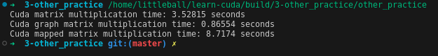

# Other Practice

除了一些优化的措施外我也做了一些其它的尝试。

## 用graph来执行

根据官方文档里介绍的，可以将一些要在某条stream上执行的任务capture，来组成一个capture graph。再结合event，graph不再是单条stream的顺序结构，而是可以结合多个stream，形成一个有向图。在graph的节点中还可以添加条件判断，做一些简单的控制逻辑。graph在执行的过程中虽然也是stream，但它在实例化的过程中可以提前完成一些工作，而且经过实例化后可以多次执行，相比于单纯的stream应该会更快。

所以我也实际用graph试了一下，实际效果并不会有明显的提速，但我觉得这个在其他地方应该会有应用。

```cpp
// 创建capture graph
cudaStreamBeginCapture(s, cudaStreamCaptureModeRelaxed);
cudaMemcpyAsync(d_mat1, mat1.data(), N * N * sizeof(double), cudaMemcpyHostToDevice, s);
cudaMemcpyAsync(d_mat2, mat2.data(), N * N * sizeof(double), cudaMemcpyHostToDevice, s);
coalesce<<<gridSize, blockSize, 0, s>>>(d_mat1, d_mat2, d_result);
cudaMemcpyAsync(result_graph.data(), d_result, N * N * sizeof(double), cudaMemcpyDeviceToHost, s);
cudaStreamEndCapture(s, &graph);

// graph实例化
cudaGraphInstantiate(&exec, graph, NULL, NULL, 0);

// 运行graph
start = std::chrono::high_resolution_clock::now();
cudaGraphLaunch(exec, s);
cudaDeviceSynchronize();
end = std::chrono::high_resolution_clock::now();
```

## 地址映射

在矩阵乘法的例子里，数据在device和host之间传输的时间开销并不明显。但我也在想能不能省去这部分拷贝数据过程，然后看到了有一个地址映射的操作。可以将host的一块数据映射到device端，相当于让kernel直接处理host的memory数据。

```cpp
// 分配结果存放的空间，获取map后的device端地址
Eigen::MatrixXd reuslt_mapped = Eigen::MatrixXd::Zero(N, N);
double *d_mat1_mapped, *d_mat2_mapped, *d_result_mapped;
cudaHostRegister(reuslt_mapped.data(), N * N * sizeof(double), cudaHostRegisterDefault);
cudaHostGetDevicePointer(&d_mat1_mapped, mat1.data(), 0);
cudaHostGetDevicePointer(&d_mat2_mapped, mat2.data(), 0);
cudaHostGetDevicePointer(&d_result_mapped, reuslt_mapped.data(), 0);

// 进行矩阵乘法
start = std::chrono::high_resolution_clock::now();
coalesce<<<gridSize, blockSize>>>(d_mat1_mapped, d_mat2_mapped, d_result_mapped);
cudaDeviceSynchronize();
end = std::chrono::high_resolution_clock::now();
```

实际运行后发现这么做会更慢，需要尽量减少host和device之间的数据拷贝！


