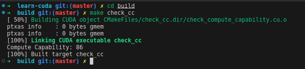

# Learn CUDA

本项目记录了我的cuda学习经历，和大多数人一样，通过优化矩阵乘法的过程来了解一些基本的概念。

## Refences

- [NVIIDA Fermi Architecture Whitepaper](https://www.nvidia.com/content/PDF/fermi_white_papers/NVIDIA_Fermi_Compute_Architecture_Whitepaper.pdf)
- [CUDA C++ Programming Guide](https://docs.nvidia.com/cuda/cuda-c-programming-guide/index.html)
- [CUDA C++ Best Practices Guide](https://docs.nvidia.com/cuda/cuda-c-best-practices-guide/index.html)

其中Fermi架构是Compute Capability 2.0的架构。从白皮书里能了解到硬件相关的一些基本概念。比如streaming multiprocessor，有时候也简称multiprocessor或者SM。一个SM里有32个cuda core，有两个warp调度器。一个warp是由32个thread组成。和硬件结合后就比较容易理解，为什么一个block里最好至少放64个thread，因为有两个warp scheduler存在，至少可以放两个warp的thread进行工作。

Programming Guide里比较详细地介绍了编程模型（Programming Model），也比较详细地介绍了一些Runtime API。CUDA也提供了更底层的Driver API，但一般Runtime API已经够用了，而且使用起来更容易。除此之外，我看的比较多的还有[不同版本的Compute Capability](https://docs.nvidia.com/cuda/cuda-c-programming-guide/index.html#compute-capabilities)的介绍，其中包括每个SM最多能同时处理的block数量，每个block最大的线程数……这些在实际调用kernel的时候都需要考虑。

Best Practices Guide介绍的优化技巧和硬件就比较相关了。特别是需要了解设备中的存储结构，因为很大部分情况下是在想办法降低访存的延时。比如[Memory Optimizations](https://docs.nvidia.com/cuda/cuda-c-best-practices-guide/index.html#memory-optimizations)这一章介绍的内容就非常值得细看。

## System Requirment

- Ubuntu 20.04
- NVIDIA Driver Version 550.67
- CUDA Version 12.4
- Eigen [repository-url](https://gitlab.com/libeigen/eigen/)
- cmake version 3.25.1
- gcc (Ubuntu 9.4.0-1ubuntu1~20.04.2) 9.4.0

## How To Build

在开始之前需要有一台带有Nvidia显卡的主机，然后安装上驱动，最新的驱动可以从[官网](https://www.nvidia.cn/geforce/drivers/)下载得到。直接运行然后按照指示进行安装即可，网上的教程需要用户手动去禁用nouveau，但现在这些操作驱动安装程序都可以完成，所以不需要额外的准备工作了（至少我安装的时候是这样的）。

驱动安装完成后再同样按照官网的指导步骤安装[CUDA Toolkit](https://developer.nvidia.com/cuda-downloads)。安装完成后再修改.zshrc或.bashrc将bin路径和lib路径添加到分别添加到PATH和LD_LIBRARY_PATH中。

```shell
export PATH=/usr/local/cuda/bin${PATH:+:${PATH}}
export LD_LIBRARY_PATH=/usr/local/cuda/lib64${LD_LIBRARY_PATH:+:${LD_LIBRARY_PATH}}
```

另外本项目依赖Eigen，因此还需要另外安装Eigen库。拉取[源码](https://gitlab.com/libeigen/eigen/)后直接install即可。

### Check Compute Capability

在开始前需要确定显卡的Compute Capability，可通过[官网](https://developer.nvidia.com/cuda-gpus)查询。也可以先编译check_cc来获取当前设备的Compute Capability。（默认查询的是device 0 的设备信息）

```shell
mkdir build
cd build
cmake ..
make check_cc
```



我的设备用到了两种显卡，因此设置的CMAKE_CUDA_ARCHITECTURES是75和86，如果你的设备用的是其他的显卡，可以修改[CMakeLists.txt](./CMakeLists.txt)，将CMAKE_CUDA_ARCHITECTURES修改成你需要的值。

### Build All

切换到build目录下，make all即可。

## Content

本项目做的主要就是用Nvidia GPU实现两个NxN的双精度矩阵乘法，在[common.h](./common.h)中，设置了N的大小以及thread block的大小。

主要内容：

1. [baseline](./0-baseline/README.md) - 最基础的矩阵乘法实现方式与eigen，cublas的实现进行对比；
2. [shared_memory](./1-shared_memory/README.md) - 用共享内存实现，减少访问global memory的次数；
3. [coalesce](./2-coalesce/README.md) - 尽可能用coalesce的形式访存；减少访问shared memory的bank冲突；
4. [other_practice](./3-other_practice/README.md) - 用capture graph执行矩阵乘法；用memory mapped方式执行矩阵乘法。
